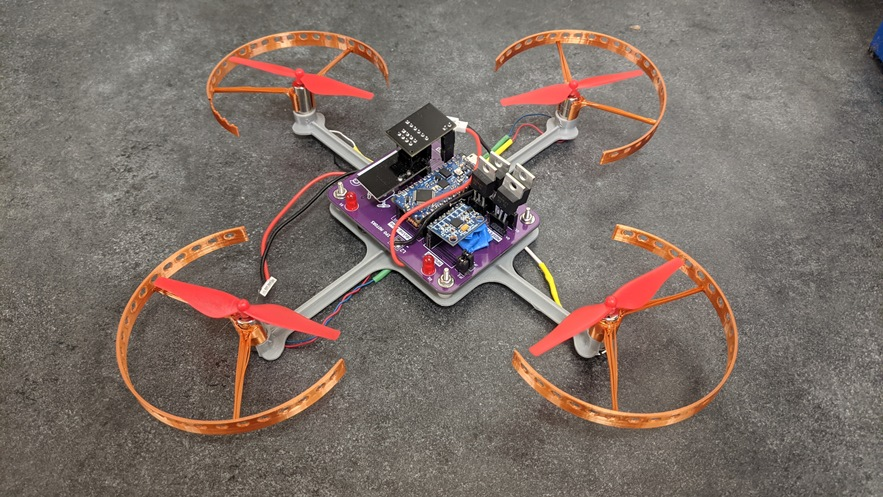
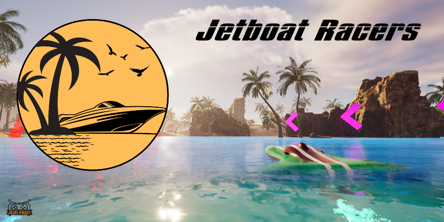
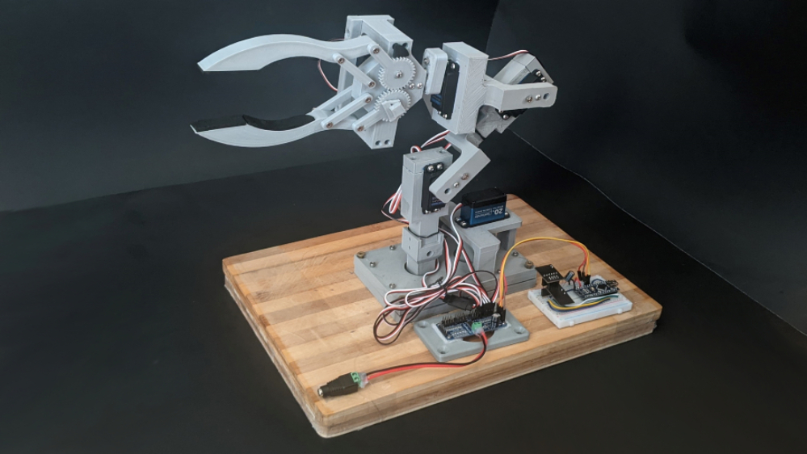

### Hello there! 👋
I am a 2A Mechatronics Engineering student at the University of Waterloo. I have a strong passion for **robotics**, **circuits and electronics**, and **game design and development**.

I am currently an Autonomy Project Manager on the **[Waterloo Aerial Robotics Group (WARG)](https://www.uwarg.com/)**, a student design team at the forefront of autonomous drone technology.

In the past, I have worked on a variety of projects ranging from embedded projects using microcontrollers such as **Arduino**, to videos games using **Unreal Engine**. Currently, I am working on Jetboat Racers, a multiplayer boat racing game with thrilling arcade physics.

Here are some examples of the biggest projects that I have worked on (click on each of them to find out more):

| Mini Copter 🚁 | Jetboat Racers 🏁 |
| :---: | :---: |
|   |  |
| Robotic Arm 💪 | Controlling the Robotic Arm Demo |
|   |  |
| STM32 Lane Keeper 🚘 | Stair Climber 🪜 |
|   |  |
| Star Wars Racer Fan Game UE4 🎮 | OmniBot 🚗 |
|   |  |

    <strong>Lidar Scanner 3D 📷 </strong>

Checkout my repositories and pins below to see more about what I do!

<!--
**AshishA26/AshishA26** is a ✨ _special_ ✨ repository because its `README.md` (this file) appears on your GitHub profile.

Here are some ideas to get you started:

- 🔭 I’m currently working on ...
- 🌱 I’m currently learning ...
- 👯 I’m looking to collaborate on ...
- 🤔 I’m looking for help with ...
- 💬 Ask me about ...
- 📫 How to reach me: ...
- 😄 Pronouns: ...
- ⚡ Fun fact: ...
-->
