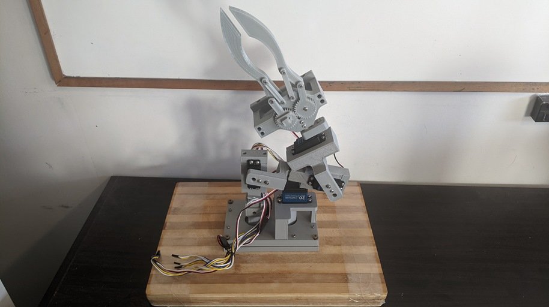
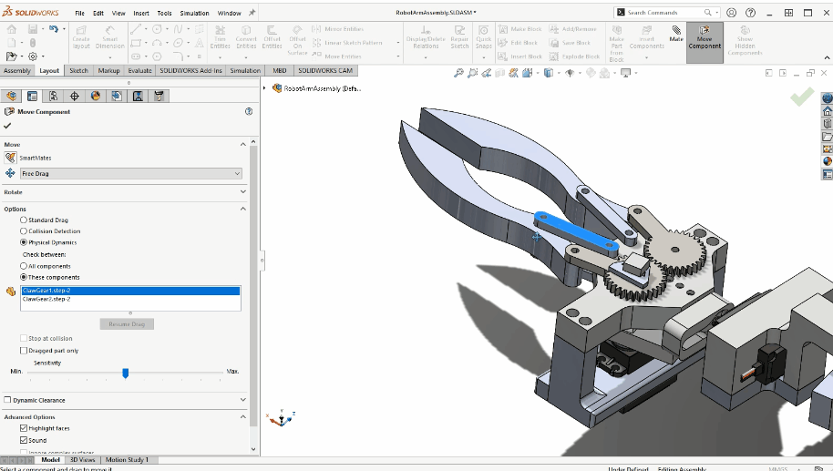

### Hello everyone! 👋
I am a developer interested in many different things related to circuits and electronics, 3D modelling, and game design and development.

Languages 📙:
- HTML, CSS, JavaScript, Kotlin, C, C++, Python, Scratch, Java

Computer skills 💻:
- SolidWorks, Autodesk (Fusion 360, Maya, TinkerCAD, Inventor), VS Code, Platform IO, Unreal Engine, Adobe (Photoshop, After Effects, Illustrator), MPLAB, Arduino, Processing, Fritzing, KiCad

Here are some examples of the biggest projects that I have worked on (click on each of them to find out more):

| Robotic Arm 💪 | Claw Demo for Robotic Arm |
| :---: | :---: |
|   |  |
| Star Wars Racer Fan Game UE4 🎮 | OmniBot 🚗 |
|   |  |

    <strong>Lidar Scanner 3D 📷 </strong>

Currently working on:
- Robotic Arm
- Mini Quadcopter

Checkout my repositories and pins below to see more about what I do!

<!--
**AshishA26/AshishA26** is a ✨ _special_ ✨ repository because its `README.md` (this file) appears on your GitHub profile.

Here are some ideas to get you started:

- 🔭 I’m currently working on ...
- 🌱 I’m currently learning ...
- 👯 I’m looking to collaborate on ...
- 🤔 I’m looking for help with ...
- 💬 Ask me about ...
- 📫 How to reach me: ...
- 😄 Pronouns: ...
- ⚡ Fun fact: ...
-->
